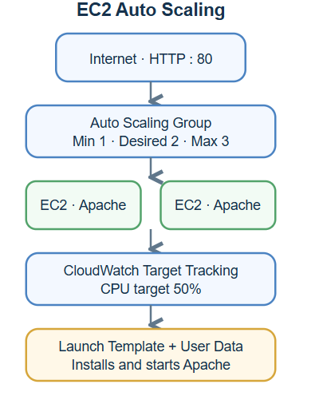
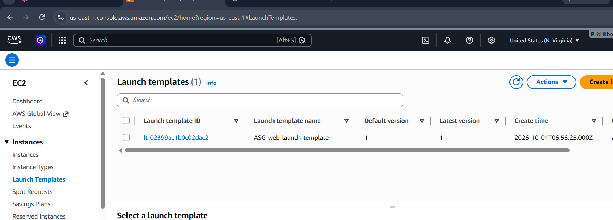
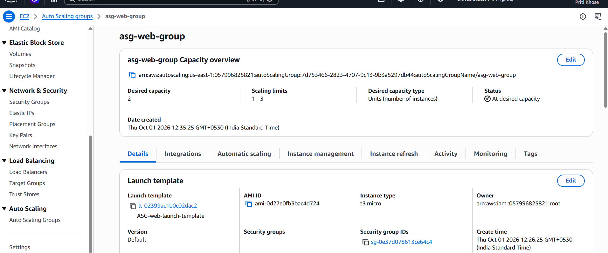
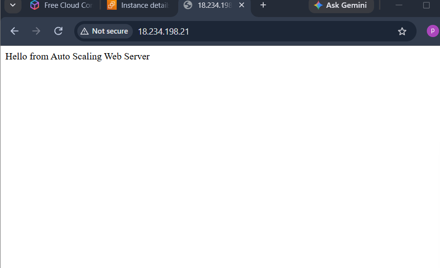
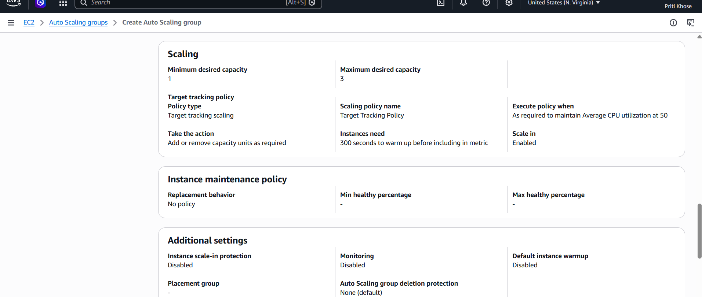
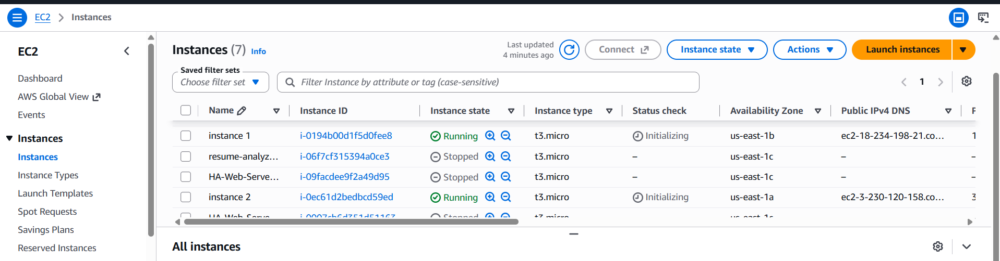

# EC2 Auto Scaling Web Server on AWS

## Project Overview

This project demonstrates a scalable web server environment using Amazon EC2 Auto Scaling. The Auto Scaling group manages EC2 instances using configured capacity settings and a CPU utilization scaling policy.

## AWS Services Used

- Amazon EC2
- EC2 Launch Template
- EC2 Auto Scaling
- Amazon CloudWatch
- Security Group
- Apache HTTP Server

## Architecture


## Configuration

### Launch Template

- **Name:** `ASG-web-launch-template`
- **AMI:** Amazon Linux 2023
- **Instance type:** `t3.micro`
- **Security group:** `asg-web-sg`
- **Web server:** Apache HTTP Server (`httpd`)



### Security Group

| Type | Port | Source |
|---|---:|---|
| SSH | 22 | My IP |
| HTTP | 80 | Anywhere IPv4 (`0.0.0.0/0`) |

### Auto Scaling Group

- **Name:** `asg-web-group`
- **Minimum capacity:** 1
- **Desired capacity:** 2
- **Maximum capacity:** 3
- **Availability Zones:** `us-east-1a`, `us-east-1b`



## User Data

The launch template uses this script to install Apache, start it, and create a basic web page:

```bash
#!/bin/bash

sudo yum update -y
sudo yum install -y httpd

sudo systemctl start httpd
sudo systemctl enable httpd

echo "Hello from Auto Scaling Web Server" | sudo tee /var/www/html/index.html
```



## CloudWatch Scaling Policy

A target tracking scaling policy is configured with:

- **Metric:** Average CPU utilization
- **Target value:** 50%
- **Scale in:** Enabled
- **Instance warm-up:** 300 seconds

The Auto Scaling group can add or remove EC2 instances to keep average CPU utilization near the configured target, within the minimum and maximum capacity limits.



## Testing

The following checks were performed:

1. Created the launch template and Auto Scaling group.
2. Set minimum, desired, and maximum capacities to 1, 2, and 3.
3. Verified the Auto Scaling group desired capacity was 2 and its status was at desired capacity.
4. Opened the Apache web page in a browser.
5. Configured the CloudWatch target tracking policy.
6. Generated CPU load using the `stress` command to exercise scaling.



## Suggested Repository Structure

```text
EC2 Auto Scaling/
├── README.md
└── screenshots/
    ├── architecture.png
    ├── 01-launch-template.png
    ├── 02-auto-scaling-group-overview.png
    ├── 03-scaling-policy.png
    ├── 04-auto-scaling-settings.png
    ├── 05-ec2-instances.png
    └── 06-web-server.png
```

## Conclusion

This project demonstrates an EC2 web server environment managed by Auto Scaling. CloudWatch target tracking monitors average CPU utilization and adjusts capacity within the configured limits.


## Author

**Priti Khose**

AWS Cloud / Cloud Engineer Fresher